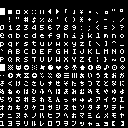
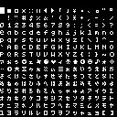

# NegaPico | PICO-8用カスタムフォント「ネガピコ」


## 概要
NegaPico（ネガピコ）は [x5y8pxNegaTape](https://github.com/hicchicc/x5y8pxNegaTape) を元に作成したPICO-8用カスタムフォントです。PICO-8のテキスト表現にご活用下さい！
- ひらがな・カタカナをコンパクトに取り扱えることを軸に、日本語表示向けの特徴を備えています。
- 記号の一部を `ぁぃぅぇぉ` `ァィゥェォ` に割り当てたバージョンがあり、これらの不足を補うことが可能です。
- 日本語入力モード `Shift + 8, 9` で入力できる `◜` `◝` 記号は `【`  `】` の形状としており強調に便利です。

## ライセンス
- 本フォント「NegaPico」は「x5y8pxNegaTape」の改変版（Modified Version）です。
- 元フォントのライセンスを引き継ぎ、**SIL Open Font License 1.1 (OFL)** に準拠しています。
- 自作ゲーム等に組み込んで公開・再配布する場合は、OFLの規定に基づき、以下のいずれかのご対応をお願いします。
1. 配布パッケージ（zipなど）の中に、本リポジトリの `OFL.txt` を同梱する。
2. 公開するWebページ（Itch.ioなど）のクレジット欄に、以下の著作権表示およびライセンスへのリンクを明記する。
##### PICO-8のコード内へ記載することも可能ですが、容量制限を考慮すると、**「2. 公開するWebページ内への記載」** がおすすめかと思います。
#### 💡 Webページへの記載例（コピー用）
```
Custom Font: NegaPico
Copyright 2026 The NegaPico Project Authors (https://github.com/hicchicc/NegaPico)

This Font Software is licensed under the SIL Open Font License, Version 1.1.
This license is available with a FAQ at: https://openfontlicense.org
```
- SIL OFLを継承して、文字の形や配置を自由に加工したり、再配布することも可能です。
- 予約済みフォント名(RFN)は宣言しないので、加工してもそのままの名称やライセンス表記で運用していただくこともできます。
  - ですが改変フォントを単体で公開する場合は、元フォントと誤認混同しないリネームへのご協力をお願いします。

## PICO-8への導入方法
1. 以下のいずれかのNegaPicoフォントデータをPICO-8の最初にコピペします。（スプライト画像から導入する方はそちらでも可）
### 💡 NegaPico（デフォルト記号版）

```lua
poke(0x5600,unpack(split"5,5,8,0,0,0,0,0,0,0,0,0,0,0,0,0,0,0,0,0,0,0,0,0,0,0,0,0,0,0,0,0,0,0,0,0,0,0,0,0,0,0,0,0,0,0,0,0,0,0,0,0,0,0,0,0,0,0,0,0,0,0,0,0,0,0,0,0,0,0,0,0,0,0,0,0,0,0,0,0,0,0,0,0,0,0,0,0,0,0,0,0,0,0,0,0,0,0,0,0,0,0,0,0,0,0,0,0,0,0,0,0,0,0,0,0,0,0,0,0,0,0,0,0,0,0,0,0,31,31,31,31,31,31,31,0,0,0,15,15,15,15,0,0,0,0,15,9,9,15,0,0,0,0,9,6,6,9,0,0,0,0,9,0,0,9,0,0,0,0,9,9,9,9,0,0,0,4,6,7,6,4,0,0,0,1,3,7,3,1,0,0,0,6,2,2,2,0,0,0,0,0,4,4,4,6,0,0,0,0,5,2,7,2,0,0,0,0,0,6,6,0,0,0,0,0,0,0,1,2,0,0,0,0,0,14,10,14,0,0,0,5,5,0,0,0,0,0,0,7,5,7,0,0,0,0,0,0,0,0,0,0,0,0,0,2,2,2,0,2,0,0,0,5,5,0,0,0,0,0,0,10,15,10,15,10,0,0,0,4,14,2,4,7,2,0,0,0,9,4,2,9,0,0,0,0,2,10,5,11,0,0,0,2,2,0,0,0,0,0,0,4,2,2,2,4,0,0,0,2,4,4,4,2,0,0,0,5,2,7,2,5,0,0,0,0,2,7,2,0,0,0,0,0,0,0,0,2,1,0,0,0,0,7,0,0,0,0,0,0,0,0,0,2,0,0,0,0,8,4,2,1,0,0,0,14,9,9,9,7,0,0,0,4,6,4,4,14,0,0,0,14,9,4,2,15,0,0,0,15,4,6,8,7,0,0,0,12,10,9,15,8,0,0,0,15,1,7,8,7,0,0,0,6,1,7,9,6,0,0,0,15,8,4,2,2,0,0,0,14,9,6,9,7,0,0,0,6,9,14,8,6,0,0,0,0,2,0,0,2,0,0,0,0,2,0,0,2,1,0,0,4,2,1,2,4,0,0,0,0,7,0,7,0,0,0,0,1,2,4,2,1,0,0,0,7,8,6,0,2,0,0,0,6,9,11,1,14,0,0,0,0,14,9,9,10,0,0,0,1,7,9,9,7,0,0,0,0,14,1,1,14,0,0,0,8,14,9,9,14,0,0,0,0,6,15,1,14,0,0,0,12,2,15,2,2,0,0,0,0,14,9,14,8,6,0,0,1,7,9,9,9,0,0,0,4,0,6,4,15,0,0,0,4,0,6,4,4,3,0,0,1,9,5,7,9,0,0,0,6,4,4,4,15,0,0,0,0,7,11,11,9,0,0,0,0,7,9,9,9,0,0,0,0,6,9,9,6,0,0,0,0,7,9,9,7,1,0,0,0,14,9,9,14,8,0,0,0,5,3,1,1,0,0,0,0,14,3,12,7,0,0,0,2,15,2,2,12,0,0,0,0,9,9,9,14,0,0,0,0,9,9,5,3,0,0,0,0,9,9,15,9,0,0,0,0,9,6,6,9,0,0,0,0,9,9,14,8,6,0,0,0,15,4,2,15,0,0,0,6,2,2,2,6,0,0,0,0,1,2,4,8,0,0,0,6,4,4,4,6,0,0,0,6,9,0,0,0,0,0,0,0,0,0,0,15,0,0,0,2,4,0,0,0,0,0,0,6,9,15,9,9,0,0,0,7,9,7,9,7,0,0,0,14,1,1,1,14,0,0,0,7,9,9,9,7,0,0,0,15,1,7,1,15,0,0,0,15,1,7,1,1,0,0,0,14,1,13,9,14,0,0,0,9,9,15,9,9,0,0,0,14,4,4,4,14,0,0,0,8,8,9,9,6,0,0,0,9,5,3,5,9,0,0,0,1,1,1,1,15,0,0,0,9,15,9,9,9,0,0,0,9,11,13,9,9,0,0,0,6,9,9,9,6,0,0,0,7,9,7,1,1,0,0,0,6,9,9,5,10,0,0,0,7,9,7,5,9,0,0,0,14,1,6,8,7,0,0,0,15,4,4,4,4,0,0,0,9,9,9,9,6,0,0,0,9,9,9,5,3,0,0,0,9,9,9,15,9,0,0,0,9,6,6,9,9,0,0,0,9,9,6,4,4,0,0,0,15,4,2,1,15,0,0,0,6,2,3,2,6,0,0,0,2,2,0,2,2,0,0,0,3,2,6,2,3,0,0,0,0,0,11,13,0,0,0,0,14,17,17,17,14,0,0,31,31,31,31,31,31,31,0,0,21,10,21,10,21,0,0,0,17,31,21,31,14,0,0,0,14,31,17,27,14,0,0,0,17,4,17,4,17,0,0,0,2,30,14,15,8,0,0,0,14,23,31,31,14,0,0,0,0,27,31,14,4,0,0,0,4,14,17,14,4,0,0,0,14,14,21,4,10,0,0,0,4,14,31,14,14,0,0,0,14,27,25,27,14,0,0,0,14,21,31,17,14,0,0,0,12,20,20,7,3,0,0,0,14,17,21,17,14,0,0,0,4,10,21,10,4,0,0,0,0,0,9,0,0,0,0,0,14,27,19,27,14,0,0,0,4,31,14,10,17,0,0,0,31,10,4,10,31,0,0,0,14,27,17,31,14,0,0,0,5,2,0,10,4,0,0,0,5,10,0,5,10,0,0,0,14,21,27,21,14,0,0,0,31,0,31,0,31,0,0,0,21,21,21,21,21,0,0,0,2,15,6,13,11,0,0,0,5,9,9,9,2,0,0,0,6,7,8,8,6,0,0,0,6,15,4,6,13,0,0,0,10,3,14,11,11,0,0,0,10,7,10,9,5,0,0,0,14,4,14,1,6,0,0,0,8,6,1,6,8,0,0,0,9,13,9,9,5,0,0,0,6,8,0,1,14,0,0,0,2,15,4,1,14,0,0,0,1,1,9,9,6,0,0,0,4,15,6,4,2,0,0,0,5,15,5,1,14,0,0,0,9,4,15,2,4,0,0,0,1,3,13,1,13,0,0,0,2,15,6,8,6,0,0,0,7,8,8,8,6,0,0,0,15,4,2,2,12,0,0,0,9,6,2,1,14,0,0,0,11,9,6,13,2,0,0,0,13,1,1,5,9,0,0,0,5,6,13,11,12,0,0,0,2,7,10,15,14,0,0,0,0,6,11,11,4,0,0,0,9,13,9,13,13,0,0,0,3,10,9,9,6,0,0,0,6,4,13,13,4,0,0,0,2,5,5,8,8,0,0,0,13,13,9,13,13,0,0,0,14,4,14,5,11,0,0,0,3,10,14,11,11,0,0,0,10,11,2,11,15,0,0,0,5,6,13,11,8,0,0,0,7,2,7,2,12,0,0,0,4,13,11,2,4,0,0,0,4,13,11,13,4,0,0,0,4,12,7,13,6,0,0,0,13,1,7,8,6,0,0,0,5,11,9,8,6,0,0,0,15,4,8,11,7,0,0,0,10,15,10,11,10,0,0,0,7,2,7,8,7,0,0,0,2,7,10,11,10,0,0,0,7,2,6,1,14,0,0,0,2,2,6,5,13,0,0,0,0,0,7,8,6,0,0,0,0,10,15,10,2,0,0,0,0,4,13,15,4,0,0,0,0,4,12,7,11,0,0,0,15,8,10,2,1,0,0,0,8,4,7,4,4,0,0,0,2,15,9,8,6,0,0,0,7,2,2,2,15,0,0,0,4,15,4,6,5,0,0,0,2,15,10,9,13,0,0,0,2,15,2,15,4,0,0,0,14,10,9,8,6,0,0,0,2,14,5,4,2,0,0,0,15,8,8,8,15,0,0,0,10,15,10,8,6,0,0,0,11,8,11,8,7,0,0,0,15,8,4,6,9,0,0,0,2,15,10,2,14,0,0,0,9,10,8,4,2,0,0,0,14,10,13,8,6,0,0,0,14,4,15,4,2,0,0,0,11,11,8,4,2,0,0,0,15,0,15,4,3,0,0,0,1,1,15,1,1,0,0,0,4,15,4,4,3,0,0,0,0,7,0,0,15,0,0,0,15,8,10,4,11,0,0,0,2,7,4,11,2,0,0,0,8,8,8,4,3,0,0,0,5,5,5,9,9,0,0,0,1,15,1,1,14,0,0,0,15,8,8,4,3,0,0,0,2,5,5,8,8,0,0,0,2,15,2,11,11,0,0,0,15,8,5,2,4,0,0,0,7,0,7,0,15,0,0,0,4,2,1,9,15,0,0,0,8,10,4,10,9,0,0,0,15,2,15,2,12,0,0,0,2,15,10,2,2,0,0,0,7,4,4,4,15,0,0,0,15,8,14,8,15,0,0,0,15,0,15,8,6,0,0,0,9,9,9,8,6,0,0,0,5,5,5,13,5,0,0,0,1,1,9,5,3,0,0,0,15,9,9,9,15,0,0,0,15,9,8,8,6,0,0,0,15,8,15,8,6,0,0,0,11,8,8,4,3,0,0,0,0,11,11,8,6,0,0,0,0,2,15,10,2,0,0,0,0,0,7,4,15,0,0,0,0,15,14,8,15,0,0,0,7,3,1,3,7,0,0,0,14,12,8,12,14,0,0"))
```
---
### 💡 NegaPico_aiueo（ぁぃぅぇぉァィゥェォ表示可能版）

```lua
poke(0x5600,unpack(split"5,5,8,0,0,0,0,0,0,0,0,0,0,0,0,0,0,0,0,0,0,0,0,0,0,0,0,0,0,0,0,0,0,0,0,0,0,0,0,0,0,0,0,0,0,0,0,0,0,0,0,0,0,0,0,0,0,0,0,0,0,0,0,0,0,0,0,0,0,0,0,0,0,0,0,0,0,0,0,0,0,0,0,0,0,0,0,0,0,0,0,0,0,0,0,0,0,0,0,0,0,0,0,0,0,0,0,0,0,0,0,0,0,0,0,0,0,0,0,0,0,0,0,0,0,0,0,0,31,31,31,31,31,31,31,0,0,0,15,15,15,15,0,0,0,0,15,9,9,15,0,0,0,0,9,6,6,9,0,0,0,0,9,0,0,9,0,0,0,0,9,9,9,9,0,0,0,4,6,7,6,4,0,0,0,1,3,7,3,1,0,0,0,6,2,2,2,0,0,0,0,0,4,4,4,6,0,0,0,0,5,2,7,2,0,0,0,0,0,6,6,0,0,0,0,0,0,0,1,2,0,0,0,0,0,14,10,14,0,0,0,5,5,0,0,0,0,0,0,7,5,7,0,0,0,0,0,0,0,0,0,0,0,0,0,2,2,2,0,2,0,0,0,5,5,0,0,0,0,0,0,10,15,10,15,10,0,0,0,4,14,2,4,7,2,0,0,0,9,4,2,9,0,0,0,0,2,10,5,11,0,0,0,2,2,0,0,0,0,0,0,4,2,2,2,4,0,0,0,2,4,4,4,2,0,0,0,5,2,7,2,5,0,0,0,0,2,7,2,0,0,0,0,0,0,0,0,2,1,0,0,0,0,7,0,0,0,0,0,0,0,0,0,2,0,0,0,0,8,4,2,1,0,0,0,14,9,9,9,7,0,0,0,4,6,4,4,14,0,0,0,14,9,4,2,15,0,0,0,15,4,6,8,7,0,0,0,12,10,9,15,8,0,0,0,15,1,7,8,7,0,0,0,6,1,7,9,6,0,0,0,15,8,4,2,2,0,0,0,14,9,6,9,7,0,0,0,6,9,14,8,6,0,0,0,0,2,0,0,2,0,0,0,0,2,0,0,2,1,0,0,4,2,1,2,4,0,0,0,0,7,0,7,0,0,0,0,1,2,4,2,1,0,0,0,7,8,6,0,2,0,0,0,6,9,11,1,14,0,0,0,0,14,9,9,10,0,0,0,1,7,9,9,7,0,0,0,0,14,1,1,14,0,0,0,8,14,9,9,14,0,0,0,0,6,15,1,14,0,0,0,12,2,15,2,2,0,0,0,0,14,9,14,8,6,0,0,1,7,9,9,9,0,0,0,4,0,6,4,15,0,0,0,4,0,6,4,4,3,0,0,1,9,5,7,9,0,0,0,6,4,4,4,15,0,0,0,0,7,11,11,9,0,0,0,0,7,9,9,9,0,0,0,0,6,9,9,6,0,0,0,0,7,9,9,7,1,0,0,0,14,9,9,14,8,0,0,0,5,3,1,1,0,0,0,0,14,3,12,7,0,0,0,2,15,2,2,12,0,0,0,0,9,9,9,14,0,0,0,0,9,9,5,3,0,0,0,0,9,9,15,9,0,0,0,0,9,6,6,9,0,0,0,0,9,9,14,8,6,0,0,0,15,4,2,15,0,0,0,6,2,2,2,6,0,0,0,0,1,2,4,8,0,0,0,6,4,4,4,6,0,0,0,6,9,0,0,0,0,0,0,0,0,0,0,15,0,0,0,2,4,0,0,0,0,0,0,6,9,15,9,9,0,0,0,7,9,7,9,7,0,0,0,14,1,1,1,14,0,0,0,7,9,9,9,7,0,0,0,15,1,7,1,15,0,0,0,15,1,7,1,1,0,0,0,14,1,13,9,14,0,0,0,9,9,15,9,9,0,0,0,14,4,4,4,14,0,0,0,8,8,9,9,6,0,0,0,9,5,3,5,9,0,0,0,1,1,1,1,15,0,0,0,9,15,9,9,9,0,0,0,9,11,13,9,9,0,0,0,6,9,9,9,6,0,0,0,7,9,7,1,1,0,0,0,6,9,9,5,10,0,0,0,7,9,7,5,9,0,0,0,14,1,6,8,7,0,0,0,15,4,4,4,4,0,0,0,9,9,9,9,6,0,0,0,9,9,9,5,3,0,0,0,9,9,9,15,9,0,0,0,9,6,6,9,9,0,0,0,9,9,6,4,4,0,0,0,15,4,2,1,15,0,0,0,6,2,3,2,6,0,0,0,2,2,0,2,2,0,0,0,3,2,6,2,3,0,0,0,0,0,11,13,0,0,0,0,14,17,17,17,14,0,0,0,0,15,8,10,2,0,0,0,0,10,3,14,11,0,0,0,0,6,7,8,6,0,0,0,14,31,17,27,14,0,0,0,0,0,7,2,15,0,0,0,2,30,14,15,8,0,0,0,14,23,31,31,14,0,0,0,0,27,31,14,4,0,0,0,0,8,4,7,4,0,0,0,14,14,21,4,10,0,0,0,4,14,31,14,14,0,0,0,14,27,25,27,14,0,0,0,14,21,31,17,14,0,0,0,12,20,20,7,3,0,0,0,0,4,15,6,5,0,0,0,4,10,21,10,4,0,0,0,0,0,10,0,0,0,0,0,14,27,19,27,14,0,0,0,4,31,14,10,17,0,0,0,31,10,4,10,31,0,0,0,0,2,15,9,4,0,0,0,0,2,15,6,13,0,0,0,5,10,0,5,10,0,0,0,0,0,5,9,11,0,0,0,31,0,31,0,31,0,0,0,0,2,15,6,11,0,0,0,2,15,6,13,11,0,0,0,5,9,9,9,2,0,0,0,6,7,8,8,6,0,0,0,6,15,4,6,13,0,0,0,10,3,14,11,11,0,0,0,10,7,10,9,5,0,0,0,14,4,14,1,6,0,0,0,8,6,1,6,8,0,0,0,9,13,9,9,5,0,0,0,6,8,0,1,14,0,0,0,2,15,4,1,14,0,0,0,1,1,9,9,6,0,0,0,4,15,6,4,2,0,0,0,5,15,5,1,14,0,0,0,9,4,15,2,4,0,0,0,1,3,13,1,13,0,0,0,2,15,6,8,6,0,0,0,7,8,8,8,6,0,0,0,15,4,2,2,12,0,0,0,9,6,2,1,14,0,0,0,11,9,6,13,2,0,0,0,13,1,1,5,9,0,0,0,5,6,13,11,12,0,0,0,2,7,10,15,14,0,0,0,0,6,11,11,4,0,0,0,9,13,9,13,13,0,0,0,3,10,9,9,6,0,0,0,6,4,13,13,4,0,0,0,2,5,5,8,8,0,0,0,13,13,9,13,13,0,0,0,14,4,14,5,11,0,0,0,3,10,14,11,11,0,0,0,10,11,2,11,15,0,0,0,5,6,13,11,8,0,0,0,7,2,7,2,12,0,0,0,4,13,11,2,4,0,0,0,4,13,11,13,4,0,0,0,4,12,7,13,6,0,0,0,13,1,7,8,6,0,0,0,5,11,9,8,6,0,0,0,15,4,8,11,7,0,0,0,10,15,10,11,10,0,0,0,7,2,7,8,7,0,0,0,2,7,10,11,10,0,0,0,7,2,6,1,14,0,0,0,2,2,6,5,13,0,0,0,0,0,7,8,6,0,0,0,0,10,15,10,2,0,0,0,0,4,13,15,4,0,0,0,0,4,12,7,11,0,0,0,15,8,10,2,1,0,0,0,8,4,7,4,4,0,0,0,2,15,9,8,6,0,0,0,7,2,2,2,15,0,0,0,4,15,4,6,5,0,0,0,2,15,10,9,13,0,0,0,2,15,2,15,4,0,0,0,14,10,9,8,6,0,0,0,2,14,5,4,2,0,0,0,15,8,8,8,15,0,0,0,10,15,10,8,6,0,0,0,11,8,11,8,7,0,0,0,15,8,4,6,9,0,0,0,2,15,10,2,14,0,0,0,9,10,8,4,2,0,0,0,14,10,13,8,6,0,0,0,14,4,15,4,2,0,0,0,11,11,8,4,2,0,0,0,15,0,15,4,3,0,0,0,1,1,15,1,1,0,0,0,4,15,4,4,3,0,0,0,0,7,0,0,15,0,0,0,15,8,10,4,11,0,0,0,2,7,4,11,2,0,0,0,8,8,8,4,3,0,0,0,5,5,5,9,9,0,0,0,1,15,1,1,14,0,0,0,15,8,8,4,3,0,0,0,2,5,5,8,8,0,0,0,2,15,2,11,11,0,0,0,15,8,5,2,4,0,0,0,7,0,7,0,15,0,0,0,4,2,1,9,15,0,0,0,8,10,4,10,9,0,0,0,15,2,15,2,12,0,0,0,2,15,10,2,2,0,0,0,7,4,4,4,15,0,0,0,15,8,14,8,15,0,0,0,15,0,15,8,6,0,0,0,9,9,9,8,6,0,0,0,5,5,5,13,5,0,0,0,1,1,9,5,3,0,0,0,15,9,9,9,15,0,0,0,15,9,8,8,6,0,0,0,15,8,15,8,6,0,0,0,11,8,8,4,3,0,0,0,0,11,11,8,6,0,0,0,0,2,15,10,2,0,0,0,0,0,7,4,15,0,0,0,0,15,14,8,15,0,0,0,7,3,1,3,7,0,0,0,14,12,8,12,14,0,0"))
```

2. 続けて以下のコマンドを書くとカスタムフォントがオンになります。
```
poke(0x5f58,0x81)
```

3. print関数で文字を表示します。
```
print("スライムか゛ あらわれた!",40,60,7)
```

### より詳しく使いたい方向けの説明

1. カスタムフォントデータをコピペした後に `poke(0x5f58,0x81)`と書くと全てのテキストにカスタムフォントが適用されます。標準フォントを使いたい時は"\15"と先頭に書くと使えます） `poke(0x5f58,0)`と書くとカスタムフォントがオフになります。また、オフの状態（標準フォント）で文字列の先頭に`\14`と書くとカスタムフォントが適用されます。例：`print("\14スライムか゛ あらわれた!",40,60,7)`
2. カタカナの小文字（ァィゥェォ）は`Shift + A, I, U, E, O`（█☉⬆️░🅾️）記号に対応しています。（表記上必須になりやすいため、入力が容易なAIUEOをカタカナ側としました）
3. ひらがなの小文字（ぁぃぅぇぉ）は`Shift + Z, X, C, V, B`（▥❎🐱ˇ▒）記号に対応しています。（可読性としてカタカナを積極的に用いた方がよいフォントでもあるため）
4. 文字を反転させたい場合は文字列の先頭に`\^i`と書くと文字の後ろに色がつきます。
5. 文字に縁取りをさせたい場合は上下左右斜めに黒で同じ文字を描画する関数を自作するとできます。
#### 💡 自作関数の例）
```
function outline_print(str, x, y, col)
  for dx = -1, 1 do
    for dy = -1, 1 do
      if dx != 0 or dy != 0 then
        print(str, x + dx, y + dy, 0)
      end
    end
  end
  print(str, x, y, col)
end

function _draw()
  cls(3)
  outline_print("outlined text (8-way)", 10, 38, 7)
end
```

5. カスタムフォントの高さや幅を調整したい方は `negapico.p8` （もしくは`negapico_aiueo.p8` ）をダウンロードしてpico8でロードし以下を変更&RUNするとカスタムフォントのデータがコピーされるので上の説明のようにお使いください。また、必要な記号があればスプライトデータを変更してください。（もしくは `LOAD #FONT_SNIPPET` で公式のカスタムフォントデータをロードしNegaPico.pngのスプライトを読み込んでお使いください。）
```
char_width = 5  // 英字の横幅
char_width2 = 5  // 日本語の横幅
char_height = 8 // 文字の高さ
```

- 参考
pico8公式BBSのカスタムフォントの説明
https://www.lexaloffle.com/bbs/?tid=41544

## 制作
hicc（患者長ひっく）
https://x.com/hicchicc

## スペシャルサンクス（敬称略）
shoma
https://x.com/DonutsHunter

PICO-8用カスタムフォント化のご提案や、動作確認、コード出力などご協力いただきました。ありがとうございます！

